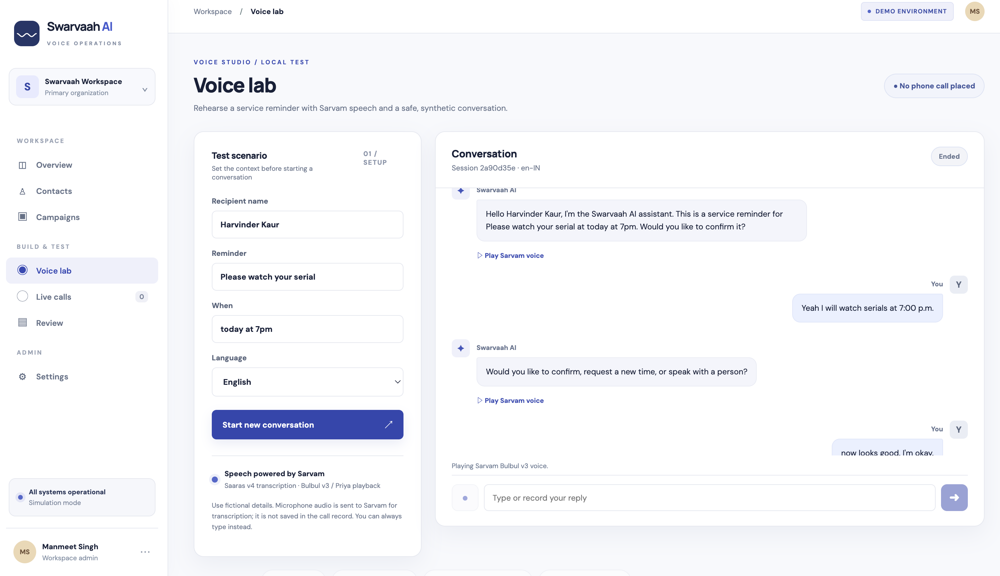
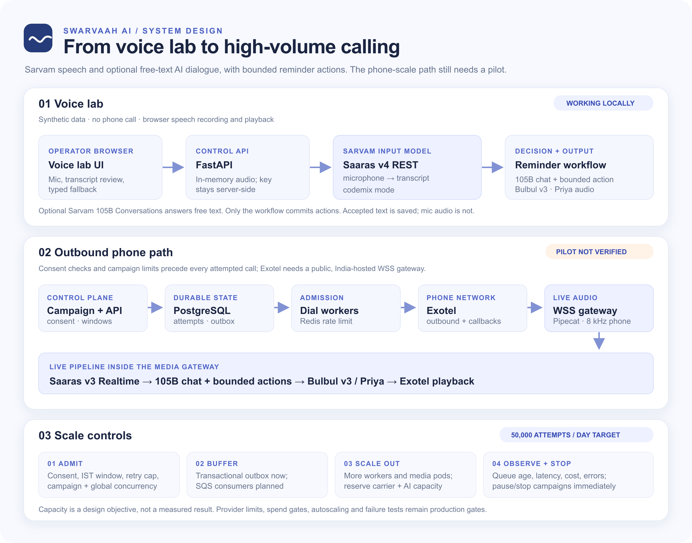

# Swarvaah AI

**A careful outbound AI calling workspace for India.** Import consented contacts, configure Hindi or English service reminders, rehearse a conversation in the browser, and monitor attempts from one console. The name evokes *swar* (voice) and *vaah* (carrying it forward).

> **Status: working local proof of concept.** The default configuration only simulates calls. Exotel and optional Twilio phone paths are implemented but have not been exercised against live accounts or real phone audio. Do not use this revision with customer data or production traffic. See [production gates](docs/production-gates.md).

## What works today

- Responsive React/TypeScript operator console: overview, contacts, campaign drafts, browser voice lab, live call list, review timeline, and audit view.
- FastAPI `/v1` control API with CSV validation, contact deduplication and suppression, campaign launch/pause/stop, test conversations, call search, and outcome correction.
- PostgreSQL backed contacts, call attempts, sessions, events, audit trail, and transactional outbox; Redis dial rate limit in the worker.
- Optional multi-turn free-text dialogue through Sarvam `sarvam-105b-conversations`. The deterministic workflow still owns confirmation, decline, reschedule request, human callback request, and durable opt-out.
- Exotel Connect Voice AI dial adapter, optional Twilio fallback, and a shared WebSocket media pipeline using Silero VAD, Pipecat, Sarvam real-time STT, and Bulbul v3 TTS. Phone paths require a controlled pilot.
- Direction-neutral `CallSession` schema; inbound number acquisition and routing remain a later release.

## Product preview



The screenshot shows the local Voice lab. It is a browser rehearsal, so the conversation shown did not place a phone call.

## Architecture



The [editable architecture SVG](docs/images/architecture.svg) is included alongside the rendered image. The diagram shows the primary Exotel path; the optional Twilio route now enters the same media pipeline when Exotel explicitly rejects a dial request. Both paths still need a controlled provider pilot.

| Path | Speech recognition | Speech output | Current status |
| --- | --- | --- | --- |
| Browser Voice lab | Sarvam **Saaras v4 REST**, `codemix` mode. A recorded clip is transcribed and the operator reviews the text before sending it. | Sarvam **Bulbul v3**, `priya` voice. The browser plays audio returned through FastAPI. | Browser audio uses local energy-based silence detection after speech starts, with manual Stop and a 15-second limit. Real browser behavior still needs device testing. |
| Exotel or Twilio phone gateway | Pipecat `SarvamRealtimeSTTService` defaults to **Saaras v3 Realtime**; configured for `auto` language, `codemix`, and `fast` stream type. | Pipecat `SarvamTTSService` explicitly selects **Bulbul v3**, `priya`. | The shared pipeline uses Silero VAD, a 600 ms speech-stop threshold, and VAD-triggered interruption. Real carrier media, barge-in quality, and end-to-end latency have not been validated. |

With `CONVERSATION_MODE=sarvam`, both paths use **Sarvam `sarvam-105b-conversations`** for open-ended, contextual replies to non-action turns. The last six exchanges are sent with the known reminder details; the model is told not to invent customer data or claim an action occurred. An explicit confirmation, decline, reschedule request, human callback, or opt-out is handled by the deterministic workflow and recorded by the backend. The model never executes those actions. If the model is unavailable, the workflow provides a bounded fallback reply. `CONVERSATION_MODE=deterministic` disables chat-model calls. The Exotel adapter signs each attempt's stream URL, and the gateway rejects unknown, suppressed, or repeated attempts.

For scale, the control plane records contacts, campaigns, attempts, and an outbox in PostgreSQL. A worker checks consent, suppression, calling window, concurrency, and Redis dial rate before requesting an Exotel call. The **50,000 attempts/day figure is a production target, not a measured result**. SQS-backed distributed consumers, autoscaled API/media workers, reserved Exotel and Sarvam capacity, cost enforcement, and load/failure testing remain production work; see [Capacity and cost](#capacity-and-cost) and [production gates](docs/production-gates.md).

### Voice activity and carrier fallback

The browser detects sustained speech, then stops recording after about 900 ms of silence. It still provides manual Stop and a 15-second ceiling. This simple energy detector is suitable for a local rehearsal, but background noise and quiet speech need device testing. On phone calls, Pipecat uses **Silero VAD** before Sarvam STT and a turn processor that can interrupt outgoing speech when the caller starts talking. The configured 600 ms stop interval is a starting point, not a validated latency or turn-quality result.

Exotel remains primary. With `TWILIO_FALLBACK_ENABLED=true`, the worker tries Twilio **only when Exotel returns an explicit HTTP 4xx rejection**. A timeout, 5xx response, or unreadable success response may mean Exotel already accepted the call; the attempt is marked `needs_review` and Twilio is not dialed. This avoids an automatic duplicate call. Twilio also receives only the already-approved contact after the same consent, calling-window, rate, and concurrency checks. The attempt stores a `twilio:`-prefixed call SID, the review detail identifies its provider, Twilio status callbacks are signature-checked, and the WebSocket handshake is signature-checked before media starts. [Twilio's call API](https://www.twilio.com/docs/voice/api/call-resource), [bidirectional Stream protocol](https://www.twilio.com/docs/voice/twiml/stream), and [signature rules](https://www.twilio.com/docs/usage/security) document the wire format.

The fallback is **disabled by default**. Before enabling it, confirm Twilio can support the approved Indian caller ID and outbound route, required throughput, and contractual India-only processing and retention. The code does not establish those commercial or data-residency conditions. Both carriers can charge for attempted calls.

## Prerequisites

- Docker Engine with Compose **or** Python 3.11–3.14, Node.js 22+, PostgreSQL 17, and Redis 7.
- No Exotel, phone number, or paid account is needed for the local text and campaign simulation. Add `SARVAM_API_KEY` to the ignored local `.env` to use Sarvam speech and chat in Voice lab.

## Run the local proof

```bash
git clone https://github.com/MANMEET75/swarvaah-ai.git
cd swarvaah-ai
docker compose up --build
```

Open [http://localhost:5173](http://localhost:5173). Choose **Load sample workspace**, create a draft campaign, use **Voice lab** to test responses, then launch a campaign to simulate dial attempts. The worker processes queued attempts and shows them in **Live calls**. Sample data is synthetic; no telephone call is placed.

For a spoken AI conversation, place your Sarvam key in `.env` and restart the API. `CONVERSATION_MODE` sets the default for the Voice lab switch and controls the phone gateway:

```dotenv
SARVAM_API_KEY=your_key_here
CONVERSATION_MODE=sarvam
SARVAM_CHAT_MODEL=sarvam-105b-conversations
```

In **Voice lab**, use the **AI conversation** switch to turn model replies on or off without restarting the API. The choice is saved in this browser and applies to the next reply, even during an active session. With it off, the deterministic reminder workflow answers. Saaras v4 transcription and Bulbul v3 playback remain available in either mode. Start a synthetic conversation, listen to the greeting, then press the microphone. Recording stops after you finish speaking and pause, or you can press Stop; the hard limit is 15 seconds. Review the transcript and press Send. With AI conversation on, ask an open question such as “What is this reminder about?” and follow up; the chat model uses recent turns to respond. You can type at any time. Explicit business actions still use the bounded workflow. Browser microphone permission is required on localhost; the API sends audio to Sarvam in memory and does not retain the recording. Sarvam speech and chat consume credits. A phone call still requires a separate media gateway and public WSS endpoint.

To stop: `docker compose down`. To erase the local database: `docker compose down -v`.

### Without Docker

```bash
python3 -m venv .venv
source .venv/bin/activate
pip install -e 'backend[voice,test]'
cd backend
uvicorn app.main:app --reload
```

In another terminal:

```bash
cd backend
../.venv/bin/python -m app.worker
```

In a third terminal:

```bash
cd web
npm ci
npm run dev
```

The non-Docker path defaults to SQLite and simulation; the worker uses its local dial limiter if Redis is absent. This is for development only.

## CSV contract

Download the template from **Contacts**. Required columns are `external_id,name,phone,reminder_at,reminder_label,consent_source,consent_at`; `language` and `suppressed` are optional. Phone must be `+91` followed by a valid mobile number. Timestamps use ISO 8601 and must include an offset. `language` is `hi-IN` or `en-IN`. A contact's `external_id` deduplicates updates; a suppressed contact remains suppressed after re-import.

Example with synthetic data:

```csv
external_id,name,phone,reminder_at,reminder_label,language,consent_source,consent_at
EX-001,Ananya Sharma,+919876543210,2026-10-08T10:00:00+05:30,check-in,hi-IN,synthetic example,2026-10-01T12:00:00+05:30
```

Do not upload real contact information into the demo. Import returns accepted, updated, and invalid row counts; rejected rows are not queued. The API is documented interactively at [http://localhost:8000/docs](http://localhost:8000/docs).

## Phone pilot setup

1. Obtain a properly provisioned Exotel Connect Voice AI account and a caller ID permitted for the service-reminder use case. Confirm its API schema, outbound rate, simultaneous call and stream limits, callback behavior, and commercial terms with Exotel.
2. Obtain Sarvam access for realtime STT and Bulbul v3 streaming TTS. Confirm India processing and storage terms, concurrent streams, permitted usage, and expected languages/voices.
3. Deploy the API and gateway with TLS in India. Exotel must reach a public `wss://` endpoint; a local `localhost` URL will not work. Use an India-region PostgreSQL and Redis service. Configure monitoring, backup, retention, and access controls before real data.
4. Copy `.env.example` to `.env` in the repository root and fill it locally. Set `SWARVAAH_MODE=production`, `CALL_MODE=exotel`, `DATABASE_URL`, `ADMIN_API_KEY`, `PUBLIC_BASE_URL`, `EXOTEL_*`, `SARVAM_API_KEY`, `REDIS_URL`, and conservative capacity limits. Set `EXOTEL_STREAM_URL` to `wss://YOUR_HOST/ws/exotel`. Never commit `.env` or paste provider keys into chat. Start `uvicorn app.voice_agent:app` as a **separate** service from `uvicorn app.main:app`.
5. Use only opted-in team numbers. Validate caller ID, call recording policy, opt-out, disconnection, callback reconciliation, barge-in, and real 8 kHz sound quality. Set `LIVE_DIAL_ENABLED=true` only for this controlled test.

To test Twilio fallback after the Exotel pilot, provision a Twilio account and approved outbound caller ID. Confirm the phone route and India data-processing requirements with Twilio. Set these values in the ignored local `.env` used by the dial worker and media gateway:

```dotenv
TWILIO_FALLBACK_ENABLED=true
TWILIO_ACCOUNT_SID=your_account_sid
TWILIO_AUTH_TOKEN=your_auth_token
TWILIO_CALLER_ID=your_approved_caller_id
TWILIO_STREAM_URL=wss://YOUR_HOST/ws/twilio
```

The same gateway must expose `/ws/twilio` and the control API must expose `/v1/webhooks/twilio` at `PUBLIC_BASE_URL`. Twilio's `<Connect><Stream>` sends an `attempt_id` custom parameter; its stream URL cannot contain query parameters. Restart the worker, API, and gateway after changing environment settings. To rehearse failover without placing a call, run the tests below; they mock Exotel and Twilio. For a real test, use one approved team number and an Exotel rejection that is known to mean **no Exotel call was created**. Check the attempt's provider, callback, and transcript before expanding. Never induce a timeout to trigger fallback: ambiguous outcomes are intentionally held for review.

For AI dialogue on the phone path, set `CONVERSATION_MODE=sarvam` on the gateway as well as the API. The same conversation service is used after realtime transcription. Model calls are currently non-streaming and can add several seconds; the end-to-end latency target has **not** been met or measured. Streaming responses, interruption handling, action-quality evaluation, and cost limits must be validated in the controlled pilot. See [production gates](docs/production-gates.md) before any customer pilot.

## Configuration

Copy `.env.example` for all available settings. The API has a demo mode with no login so it must bind only to a trusted local environment. The non-demo API uses a single API key; the React client must **not** contain that key. A real operator deployment needs an identity provider, sessions, role enforcement, CSRF protections, and a server-side frontend proxy. The current console is for local evaluation.

## Tests

```bash
cd backend && ../.venv/bin/pytest -q
cd ../web && npm ci && npm run build
docker compose config --quiet
```

Tests cover CSV admission/deduplication, transactional campaign queueing, opt-out, invalid imports, multi-turn AI dialogue, explicit-rejection fallback, uncertain-outcome protection, Twilio TwiML, signed callbacks and media handshakes, and construction of the Pipecat VAD and turn processors. The real Sarvam chat endpoint was exercised previously with two synthetic local Voice lab turns. Neither carrier's phone path nor browser silence detection has been verified on real audio yet. CI installs the voice dependencies and runs Python tests, TypeScript build, and a secret scan.

## Capacity and cost

The **first production objective** is 50,000 attempts/day, not 50,000 concurrent conversations. An eight-hour operating window needs roughly 104 attempts/minute on average. A planning mix of 30% answered for 3 minutes and 70% unanswered for 20 seconds yields ~118 occupied channels on average. Size for measured peaks, provider rates, websocket streams, STT/TTS concurrency, worker CPU, and cost. A 5 million or 500 million attempts/day product is a separate carrier and infrastructure program.

The current worker has global and campaign concurrency limits, an IST calling window, suppression checks, and a Redis dial rate limit. It does **not** yet enforce an actual spend cap, compute full cost per success, or provide distributed SQS consumer semantics. Production gates list these items explicitly.

## Project layout

```text
backend/app/       FastAPI control plane, domain models, workflow, worker, Exotel/Twilio and media gateway
backend/tests/     API and domain tests
web/src/           Operator console
infra/terraform/   Infrastructure starter configuration
docs/              Architecture, operations and production gates
docs/images/       Voice lab screenshot and architecture image/source
compose.yaml       Local demo stack
```

## License

Apache-2.0; see [LICENSE](LICENSE).
