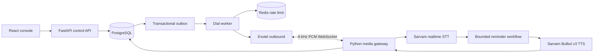

# Swarvaah AI

**A careful outbound AI calling workspace for India.** Import consented contacts, configure Hindi or English service reminders, rehearse a conversation in the browser, and monitor attempts from one console. The name evokes *swar* (voice) and *vaah* (carrying it forward).

> **Status: working local proof of concept.** The default configuration only simulates calls. An Exotel/Sarvam media path is implemented but has not been exercised against live accounts or real phone audio. Do not use this revision with customer data or production traffic. See [production gates](docs/production-gates.md).

## What works today

- Responsive React/TypeScript operator console: overview, contacts, campaign drafts, browser voice lab, live call list, review timeline, and audit view.
- FastAPI `/v1` control API with CSV validation, contact deduplication and suppression, campaign launch/pause/stop, test conversations, call search, and outcome correction.
- PostgreSQL backed contacts, call attempts, sessions, events, audit trail, and transactional outbox; Redis dial rate limit in the worker.
- Deterministic service reminder dialogue with confirmation, decline, reschedule request, human callback request, and durable opt-out.
- Exotel Connect Voice AI dial adapter and WebSocket media gateway using Pipecat, Sarvam real time STT, and Bulbul v3 TTS. This path requires a controlled phone pilot.
- Direction-neutral `CallSession` schema; inbound number acquisition and routing remain a later release.

## Architecture



The conversation logic does not need an LLM to take action. It selects a known outcome and records the action before speaking a confirmation. This keeps the browser proof usable without model credentials. The Exotel adapter signs the per-attempt stream URL and the media gateway rejects unknown, suppressed, or repeated attempts.

## Prerequisites

- Docker Engine with Compose **or** Python 3.11–3.14, Node.js 22+, PostgreSQL 17, and Redis 7.
- No Exotel, phone number, or paid account is needed for the local text and campaign simulation. Add `SARVAM_API_KEY` to the ignored local `.env` to use Sarvam speech in Voice lab.

## Run the local proof

```bash
git clone https://github.com/MANMEET75/swarvaah-ai.git
cd swarvaah-ai
docker compose up --build
```

Open [http://localhost:5173](http://localhost:5173). Choose **Load sample workspace**, create a draft campaign, use **Voice lab** to test responses, then launch a campaign to simulate dial attempts. The worker processes queued attempts and shows them in **Live calls**. Sample data is synthetic; no telephone call is placed.

For a spoken Voice lab test, place your Sarvam key in `.env` as `SARVAM_API_KEY=...` and restart the API. In **Voice lab**, start a synthetic conversation, listen to the greeting, then press the microphone to record up to 15 seconds. Press it again to stop, review the Saaras v4 transcript, and press Send. Bulbul v3 reads the reply aloud. You can type a reply at any time. Browser microphone permission is required on localhost; the API sends audio to Sarvam in memory and does not retain the recording. Voice lab requires network access to Sarvam and consumes a small amount of credit. A phone call still requires the separate Exotel media gateway and public WSS endpoint.

To stop: `docker compose down`. To erase the local database: `docker compose down -v`.

### Without Docker

```bash
python3 -m venv .venv
source .venv/bin/activate
pip install -e 'backend[test]'
cd backend
uvicorn app.main:app --reload
```

In another terminal:

```bash
cd backend
../.venv/bin/python -m app.worker
```

In a third terminal:

```bash
cd web
npm ci
npm run dev
```

The non-Docker path defaults to SQLite and simulation; the worker uses its local dial limiter if Redis is absent. This is for development only.

## CSV contract

Download the template from **Contacts**. Required columns are `external_id,name,phone,reminder_at,reminder_label,consent_source,consent_at`; `language` and `suppressed` are optional. Phone must be `+91` followed by a valid mobile number. Timestamps use ISO 8601 and must include an offset. `language` is `hi-IN` or `en-IN`. A contact's `external_id` deduplicates updates; a suppressed contact remains suppressed after re-import.

Example with synthetic data:

```csv
external_id,name,phone,reminder_at,reminder_label,language,consent_source,consent_at
EX-001,Ananya Sharma,+919876543210,2026-10-08T10:00:00+05:30,check-in,hi-IN,synthetic example,2026-10-01T12:00:00+05:30
```

Do not upload real contact information into the demo. Import returns accepted, updated, and invalid row counts; rejected rows are not queued. The API is documented interactively at [http://localhost:8000/docs](http://localhost:8000/docs).

## Phone pilot setup

1. Obtain a properly provisioned Exotel Connect Voice AI account and a caller ID permitted for the service-reminder use case. Confirm its API schema, outbound rate, simultaneous call and stream limits, callback behavior, and commercial terms with Exotel.
2. Obtain Sarvam access for realtime STT and Bulbul v3 streaming TTS. Confirm India processing and storage terms, concurrent streams, permitted usage, and expected languages/voices.
3. Deploy the API and gateway with TLS in India. Exotel must reach a public `wss://` endpoint; a local `localhost` URL will not work. Use an India-region PostgreSQL and Redis service. Configure monitoring, backup, retention, and access controls before real data.
4. Copy `.env.example` to `.env` in the repository root and fill it locally. Set `SWARVAAH_MODE=production`, `CALL_MODE=exotel`, `DATABASE_URL`, `ADMIN_API_KEY`, `PUBLIC_BASE_URL`, `EXOTEL_*`, `SARVAM_API_KEY`, `REDIS_URL`, and conservative capacity limits. Set `EXOTEL_STREAM_URL` to `wss://YOUR_HOST/ws/exotel`. Never commit `.env` or paste provider keys into chat. Start `uvicorn app.voice_agent:app` as a **separate** service from `uvicorn app.main:app`.
5. Use only opted-in team numbers. Validate caller ID, call recording policy, opt-out, disconnection, callback reconciliation, barge-in, and real 8 kHz sound quality. Set `LIVE_DIAL_ENABLED=true` only for this controlled test.

The pilot is deliberately gated. There is no live phone score or measured latency claim yet. See [production gates](docs/production-gates.md) before any customer pilot.

## Configuration

Copy `.env.example` for all available settings. The API has a demo mode with no login so it must bind only to a trusted local environment. The non-demo API uses a single API key; the React client must **not** contain that key. A real operator deployment needs an identity provider, sessions, role enforcement, CSRF protections, and a server-side frontend proxy. The current console is for local evaluation.

## Tests

```bash
cd backend && ../.venv/bin/pytest -q
cd ../web && npm ci && npm run build
docker compose config --quiet
```

Tests cover CSV admission/deduplication, transactional campaign queueing, opt-out, and invalid imports. The phone path remains unverified until a provider pilot. CI runs Python tests, TypeScript build, and a secret scan.

## Capacity and cost

The **first production objective** is 50,000 attempts/day, not 50,000 concurrent conversations. An eight-hour operating window needs roughly 104 attempts/minute on average. A planning mix of 30% answered for 3 minutes and 70% unanswered for 20 seconds yields ~118 occupied channels on average. Size for measured peaks, provider rates, websocket streams, STT/TTS concurrency, worker CPU, and cost. A 5 million or 500 million attempts/day product is a separate carrier and infrastructure program.

The current worker has global and campaign concurrency limits, an IST calling window, suppression checks, and a Redis dial rate limit. It does **not** yet enforce an actual spend cap, compute full cost per success, or provide distributed SQS consumer semantics. Production gates list these items explicitly.

## Project layout

```text
backend/app/       FastAPI control plane, domain models, workflow, worker, Exotel and media gateway
backend/tests/     API and domain tests
web/src/           Operator console
infra/terraform/   Infrastructure starter configuration
docs/              Architecture, operations and production gates
compose.yaml       Local demo stack
```

## License

Apache-2.0; see [LICENSE](LICENSE).
